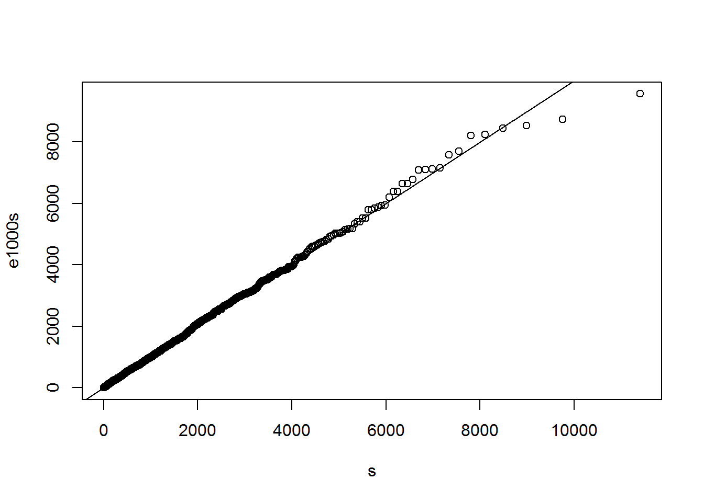
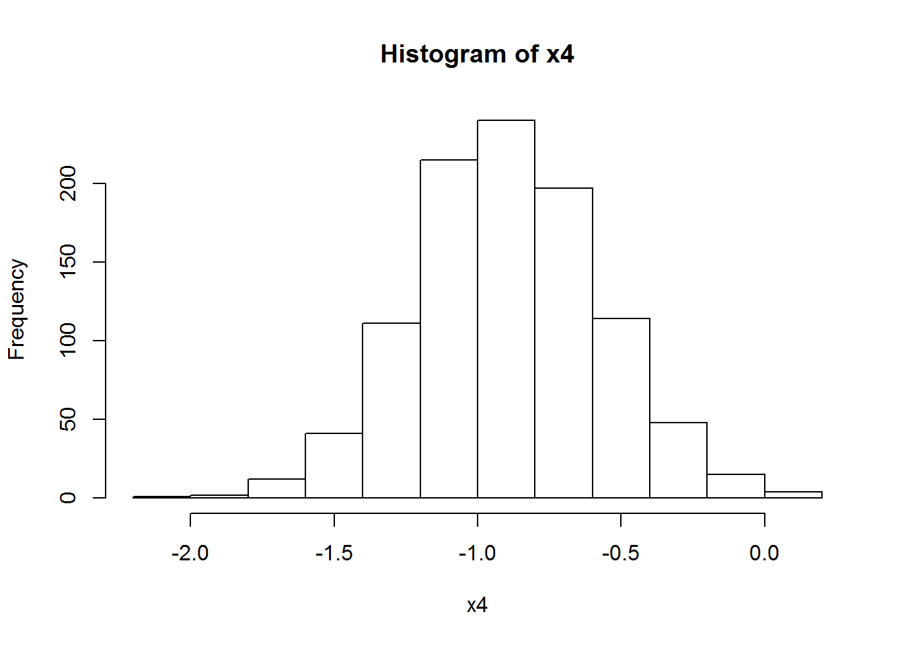

<!--
%\VignetteEngine{knitr::rmarkdown}
%\VignetteIndexEntry{Supplementary materials}
-->


## Packages and functions for topic "goodness of fit"
### Functions in base R


```r
?ks.test
?ecdf
?qqnorm
?qqline
```

### Package "psistat"
Package psistat provides some useful functions for this topic. You can install it on your
own computers from the web page of the course (if you have not done this yet).


```r
library(psistat)
```

The names of the functions in "psistat" start with "psi.". You can learn more about them
using the help system. For example:


```r
apropos("psi.*")
help(package="psistat")
package ? psistat
?psi.eqf
?psi.Dn
?psi.lks.exp.test
?psi.jitter
```

### Other libraries providing relevant functions:


```r
library(nortest) # for Lilliefors test
?lillie.test
```

```r
library(e1071)  # for probplot
?probplot
```

Dataset Oxboys is in package "mlmRev"


```r
library(mlmRev)
# ?Oxboys
```

Miscellaneous: use this command to plot in a new window:


```r
dev.new()
```

Some random samples for the following examples.


```r
x20 <- rnorm(20)            # a short random sample, to show it on screen
x200 <- rnorm(200)          # larger
x500 <- rnorm(500)          # even larger
x500ms <- rnorm(500, mean = 1, sd = 3)

x2 <- rchisq(100, df = 2)

xe <- rexp(500, rate = 1/1500) # life times of electric bulbs
```

## Empirical cdf (ecdf)


```r
x20.ecdf <- ecdf(x20)              # its ecdf
x20.ecdf
```

```
## Empirical CDF 
## Call: ecdf(x20)
##  x[1:20] = -2.3457, -1.2071, -0.99839,  ..., 1.0844, 2.4158
```

x20.ecdf is a function - we can use it as any other R function:


```r
x20.ecdf(0)
```

```
## [1] 0.65
```

```r
x20.ecdf(10)
```

```
## [1] 1
```

Here we plot the ecdf and overlay the cdf used to simulate the data. The sample is small,
so the two do not match very closely:


```r
plot(x20.ecdf)
curve(pnorm, add = TRUE, col = "blue")
```


At the places were the ecdf jumps, the value is the one after the jump (indicated by the
filled points).
Here is a histogram with overlayed pdf for comparison.


```r
hist(x20, freq = FALSE, ylim = c(0, 0.5))
curve(dnorm, add = TRUE)
```


For larger samples the ecdf is very good estimator of the underlying cdf:


```r
x200.ecdf <- ecdf(x200)
plot(x200.ecdf)
curve(pnorm, add = TRUE, col = "red")
```


... and an even larger sample:


```r
x500.ecdf <- ecdf(x500)            # its ecdf
plot(x500.ecdf)                    # ecdf and cdf overlayed
curve(pnorm, add = TRUE, col = "red")
## This shows how to add the curve with non-default values of the
## arguments. This simply illustrates the technique:
norm2 <- function(x) pnorm(x, mean = 2)
curve(norm2, add = TRUE, col = "blue")
```


## Empirical quantiles


```r
# ?quantile
quantile(x500, probs=0.5)
```

```
##          50% 
## -0.005702427
```

```r
quantile(x500, probs= c(0.25,0.5, 0.75))
```

```
##          25%          50%          75% 
## -0.700895608 -0.005702427  0.604292246
```

```r
quantile(x20, 0.5)
```

```
##        50% 
## -0.5288207
```

```r
hist(x20, freq=FALSE, ylim = c(0, 0.5))
curve(dnorm, from = -3, to = 3,  add = TRUE, col = "blue")
```


### Examples with psi.eqf
Empirical quantile function (from package "psistat")


```r
?psi.eqf
```

The eqf of a small sample:


```r
x20.eqf <- psi.eqf(x20)
plot(x20.eqf, main = "Eqf of x20")
curve(qnorm, add = TRUE, col = "blue")
```

```
## Warning in qnorm(x): NaNs produced
```


```r
# plot(x200)
x200ecdf <- ecdf(x200)
x200ecdf(0)
```

```
## [1] 0.54
```

```r
quantile(x200, c(.25, .5, 0.75))
```

```
##         25%         50%         75% 
## -0.65421071 -0.08424212  0.62585887
```

```r
x200eqf <- psi.eqf(x200)
x200eqf(0.5)
```

```
## [1] -0.09979059
```

```r
x200eqf(0.25)
```

```
## [1] -0.6696336
```

```r
plot(x200eqf, main = "Eqf of x200")
```


```r
x500.eqf <- psi.eqf(x500)          # a larger sample
plot(x500.eqf, main = "Eqf of x500")
curve(qnorm, add = TRUE, col = "blue")
```

```
## Warning in qnorm(x): NaNs produced
```


## QQ-plots
### DIY qq-plots
We follow the procedure given in the notes: prepare points p,
evaluate the scores s,  compute the order statistics and plot.
Does x20 come from N(0,1)?


```r
n <- length(x20)
n
```

```
## [1] 20
```

```r
p <- (1:n - 0.5)   # to check that it gives 0.5, 1.5, ..., 19.5
p
```

```
##  [1]  0.5  1.5  2.5  3.5  4.5  5.5  6.5  7.5  8.5  9.5 10.5 11.5 12.5 13.5
## [15] 14.5 15.5 16.5 17.5 18.5 19.5
```

```r
p <- (1:n - 0.5)/n
p
```

```
##  [1] 0.025 0.075 0.125 0.175 0.225 0.275 0.325 0.375 0.425 0.475 0.525
## [12] 0.575 0.625 0.675 0.725 0.775 0.825 0.875 0.925 0.975
```

```r
s <- qnorm(p)            # scores
x20.sorted <- sort(x20)  # order statistics
plot(s, x20.sorted)      # qq-plot
abline(0, 1, col = "blue") # plot the reference line
```


Does x2 come from N(0,1)?


```r
n <- length(x2)
p <- ((1:n) - 0.5) / n
s2 <- qnorm(p)
x2s <- sort(x2)
plot(s2, x2s)
abline(0, 1, col = "red")
```


Does x200 come from N(0,1)?


```r
n <- length(x200)
p <- ((1:n) - 0.5) / n
si <- qnorm(p)
x200.sorted <- sort(x200)
plot(si, x200.sorted)
abline(0, 1, col = "blue")
```


Does x200 come from Student-t with 3 d.f.?


```r
si <- qt(p, df = 3)
plot(si, x200.sorted)
abline(0,1, col = "blue")
```


Does x500 come from N(0,1)?


```r
n <- length(x500)                  # x500
p <- (1:n - 0.5)/n
s <- qnorm(p)
x500.sorted <- sort(x500)
plot(s, x500.sorted)
abline(0,1)                        # various ways to overlay a line
lm(x500.sorted ~ s)
```

```
## 
## Call:
## lm(formula = x500.sorted ~ s)
## 
## Coefficients:
## (Intercept)            s  
##    -0.03162      1.00690
```

```r
abline(lm(x500.sorted ~ s), col = "red")
qqline(x500.sorted)
```


qq-plots for x500 The following examples are of qq-plots for x500
with various non-matching distributions.


```r
s <- qt(p, df = 3)      # H0 is t_3 dist
plot(s, x500.sorted)
abline(0, 1, col="blue")
```


```r
s <- qnorm(p, mean = 5) # H0 is N(5,1)
plot(s,x500.sorted)
abline(0, 1, col = "blue")
```


```r
s <- qnorm(p, mean = 5, sd = 2) # H0 is N(5,2^2)
plot(s, x500.sorted)
abline(0, 1, col = "blue")
```


```r
x500ms.sorted <- sort(x500ms)
p <- ((1:500) - 0.5)/500
s <- qnorm(p)
plot(s, x500ms.sorted)
abline(0, 1, col = "blue")

lmfit500 <- lm(x500ms.sorted ~ s)
summary(lmfit500)
```

```
## 
## Call:
## lm(formula = x500ms.sorted ~ s)
## 
## Residuals:
##      Min       1Q   Median       3Q      Max 
## -1.34243 -0.04548  0.02041  0.07568  0.24411 
## 
## Coefficients:
##             Estimate Std. Error t value Pr(>|t|)    
## (Intercept) 0.958476   0.006293   152.3   <2e-16 ***
## s           2.889440   0.006301   458.6   <2e-16 ***
## ---
## Signif. codes:  0 '***' 0.001 '**' 0.01 '*' 0.05 '.' 0.1 ' ' 1
## 
## Residual standard error: 0.1407 on 498 degrees of freedom
## Multiple R-squared:  0.9976,	Adjusted R-squared:  0.9976 
## F-statistic: 2.103e+05 on 1 and 498 DF,  p-value: < 2.2e-16
```

```r
abline(lmfit500, col = "red")
```


qq-plot example with an exponential distribution. First generate some data to work with:
xe might represent lifetime of bulbs (incandescent have typical expected life equal to
1500 hours).


```r
hist(xe)
```


```r
n <- length(xe)
p <- ((1:n) - 0.5) / n
s <- qexp(p, rate = 1/1500)
plot(s, sort(xe))
```


### Non-diy qq-plots
qqnorm produces a normal qq-plot, i.e. a qq-plot for hypothesised normal distribution:


```r
qqnorm(x500ms)
abline(0,1)
```


```r
qqnorm(x500)                   # qqnorm
```


```r
qqnorm(xe)     # no match here
```


probplot() is another function for qq-plots. Without further
arguments it produces a normal plot:


```r
library(e1071, quiet = TRUE)  # for probplot
probplot(x500)
```


For other hypothesised distributions the relevant quantile function should be given.
We often need to define the function ourselves.


```r
#
# this doesn't work since probplot insists on naming the argument 'p'
# qexp1500 <- function(x) qexp(x, rate=1/1500)
#
                                        # here we oblige.
```

This function computes quantiles for exponential distribution with mean 1500:


```r
qexp1500 <- function(p) qexp(p, rate = 1/1500)
```

(Note that probplot insists that the first argument is called 'p'.)
Compare:


```r
qexp1500(0.5)
```

```
## [1] 1039.721
```

```r
qexp(0.5, rate=1/1500)
```

```
## [1] 1039.721
```

Create the plot:


```r
probplot(xe, qexp1500)
```


```r
x2a <- rnorm(500, mean=5, sd=2)
qqnorm(x2a)
```


```r
mean(x2a)
```

```
## [1] 5.11848
```

```r
sd(x2a)
```

```
## [1] 2.120752
```

example: bulbs.txt


```r
bulbs <- scan("bulbs.txt")
bulbs
```

```
##  [1] 1615.3880 1751.3540  951.2327 3727.3430 1333.2010  914.8320  507.4933
##  [8]  213.3106  862.1596 2217.3740
```

```r
qexp1500 <- function(p){ qexp(p, rate=1/1500) }
probplot(bulbs, qdist = qexp1500)
```


```r
e100 <- rexp(100, rate=1/1500)
p <- ((1:100) - 0.5)/100
s <- qexp(p, rate=1/1500)
e100s <- sort(e100)
plot(s, e100s)
abline(0,1)
```


```r
e1000 <- rexp(1000, rate=1/1500)
p <- ((1:1000) - 0.5)/1000
s <- qexp(p, rate=1/1500)
e1000s <- sort(e1000)
plot(s, e1000s)
abline(0,1)
```



```r
s <- qnorm(p)
plot(s, e1000s)
```


```r
library(e1071)
probplot(e1000, qexp)
```


```r
probplot(e1000, qnorm)
```


```r
# ?qexp

qchisq5 <- function(p) qchisq(p, df=5)
probplot(e1000,qchisq5)
```


## Distributions of order statistics
Approx mean and variance of order statistics
example in Notes, p. 69

first using formulae on pp. 68-69


```r
qnorm(4/(19+1))
```

```
## [1] -0.8416212
```

```r
ex <- qnorm(4/(19+1))
ex
```

```
## [1] -0.8416212
```

```r
exvar <- 4*(19-4+1)/((19+1)^2*(19+2))/dnorm(ex)^2
exvar
```

```
## [1] 0.09720817
```

... then via simulation


```r
y <- numeric(1000)
y[1] <- sort(rnorm(19))[4]
y[2] <- sort(rnorm(19))[4]
```

and so on until y[1000] ... :)


```r
# ... but better use a single command
for(i in 1:1000) y[i] <- sort(rnorm(19))[4]

hist(y, freq=FALSE)  # estimate density
```


```r
mean(y)              # estimate mean
```

```
## [1] -0.8928535
```

```r
var(y)               # estimate variance
```

```
## [1] 0.1049445
```

this is an alternative to the 'for' loop
     (explain "replicate")


```r
y <- replicate(1000, sort(rnorm(19))[4])
mean(y)
```

```
## [1] -0.8994723
```

```r
var(y)
```

```
## [1] 0.1124937
```

```r
quantile(y, c(0.25,0.5,0.75))
```

```
##        25%        50%        75% 
## -1.1191086 -0.8994697 -0.6677008
```

```r
N <- 1000
x4 <- numeric(N)
x4[1] <- sort(rnorm(19))[4]
x4[1]
```

```
## [1] -0.6385599
```

```r
x4[2] <- sort(rnorm(19))[4]
# ... and so on; let's do it with a single command:
for(i in 1:N) x4[i] <- sort(rnorm(19))[4]
```

Explore the distribution of the fourth order statistic:


```r
mean(x4)
```

```
## [1] -0.8927811
```

```r
var(x4)
```

```
## [1] 0.1052386
```

```r
hist(x4)
```



```r
x4ecdf <- ecdf(x4)
curve(x4ecdf, from = -2, to = 2)
```


```r
plot(x4ecdf)
curve(pnorm, add = TRUE, col = "red")
```


## Inverse PIT
DIY generation of a random sample from distribution Expo(1/2)
First generate a sample from the uniform distribution.


```r
u <- runif(8)
u
```

```
## [1] 0.96726824 0.39173353 0.93379904 0.76794545 0.32535914 0.57392644
## [7] 0.06652616 0.87910583
```

Evaluate the quantiles of the required distribution (Expo(1/2) here) for the values in the
U(0,1) random sample:


```r
y <- -2*log(1-u)     #  DIY quantile function of Expo(1/2)
y
```

```
## [1] 6.8388189 0.9942844 5.4301207 2.9215656 0.7871496 1.7062866 0.1376847
## [8] 4.2256796
```

```r
y1 <- qexp(u, rate = 1/2) # built-in quantile function
y1
```

```
## [1] 6.8388189 0.9942844 5.4301207 2.9215656 0.7871496 1.7062866 0.1376847
## [8] 4.2256796
```

The results are the same (so, qexp uses the formula -log(1-u)/lambda):


```r
all(y == y1)
```

```
## [1] TRUE
```

## Kolmogorov-Smirnov tests


```r
u <- runif(100)
x <- -1/2*log(1-u)
ks.test(x, "pexp", rate=2)
```

```
## 
## 	One-sample Kolmogorov-Smirnov test
## 
## data:  x
## D = 0.087857, p-value = 0.423
## alternative hypothesis: two-sided
```

```r
ks.test(x, "pexp", rate=10)
```

```
## 
## 	One-sample Kolmogorov-Smirnov test
## 
## data:  x
## D = 0.56113, p-value < 2.2e-16
## alternative hypothesis: two-sided
```

```r
pexp2 <- function(x) pexp(x, rate = 2)
ks.test(x, pexp2)
```

```
## 
## 	One-sample Kolmogorov-Smirnov test
## 
## data:  x
## D = 0.087857, p-value = 0.423
## alternative hypothesis: two-sided
```

```r
psi.Dn(x, pexp2)
```

```
## [1] 0.08785689
```

```r
x <- runif(10)
x
```

```
##  [1] 0.60772038 0.71454058 0.31063085 0.40909066 0.05476674 0.87197316
##  [7] 0.80187151 0.04541741 0.35022657 0.16252157
```

```r
y <- -1/2*log(1-x)
y
```

```
##  [1] 0.46789019 0.62682769 0.18598919 0.26304634 0.02816177 1.02775768
##  [7] 0.80941975 0.02324056 0.21556577 0.08867989
```

```r
y1 <- qexp(x, rate=2)
y1
```

```
##  [1] 0.46789019 0.62682769 0.18598919 0.26304634 0.02816177 1.02775768
##  [7] 0.80941975 0.02324056 0.21556577 0.08867989
```

```r
all(y==y1)  # TRUE (so, qexp uses the above formula
```

```
## [1] TRUE
```

The cdf of the test statistic in KS test
See examples for psi.pks.


```r
# ?psi.pks
psi.pks(0.6239385,4)
```

```
## [1] 0.95
```

```r
psi.pks(0.2940753,20)
```

```
## [1] 0.95
```

```r
psi.pks(0.1340279,100)
```

```
## [1] 0.95
```

```r
psi.pks(0.04294685,1000)
```

```
## [1] 0.95
```

Compare the distribution of the test statistic for various sample sizes:


```r
xi <- seq(0,1,length=100)            # some x values
plot(xi,psi.pks(xi,4))
lines(xi,psi.pks(xi,4))              # cdf of D_4
lines(xi,psi.pks(xi,50),col="blue")  # overlay the cdf of  D_{50}
lines(xi,psi.pks(xi,100),col="red")  # overlay the cdf of  D_{100}
abline(h=0.95, col="brown")
lines(xi,psi.pks(xi,1000),col="green")  # overlay the cdf of  D_{1000}
```


The abscissa of the intersection of the brown line with each of the curves gives the
corresponding critical value of the KS test. Notice that for larger samples the critical
value is smaller. In other words, smaller deviations from the hypothesised distribution
function are considered significant.
Similar to above using curve():


```r
curve(psi.pks(x,4), from=0, to=1)                             # cdf of D_4
curve(psi.pks(x,10), from=0, to=1, col="blue", add=TRUE)      # cdf of D_10
curve(psi.pks(x,50), from=0, to=1, col="brown", add=TRUE)     # cdf of D_50
curve(psi.pks(x,100), from=0, to=1, col="red", add=TRUE)      # cdf of D_100
curve(psi.pks(x,1000), from=0, to=1, col="green", add=TRUE)   # cdf of D_1000
abline(h=0.95, col="brown")
```


### DIY Dn


```r
x10 <- rnorm(10)
```

diy Dn for H_0 = cdf of N(0,1)


```r
u10 <- pnorm(x10)
u10
```

```
##  [1] 0.50005467 0.94167283 0.57367674 0.25966462 0.79541192 0.95330771
##  [7] 0.33814719 0.06689247 0.81922995 0.23913859
```

```r
u10 <- sort(pnorm(x10))
u10
```

```
##  [1] 0.06689247 0.23913859 0.25966462 0.33814719 0.50005467 0.57367674
##  [7] 0.79541192 0.81922995 0.94167283 0.95330771
```

```r
n <- 10
x10Dn <- max((1:n)/n - u10, u10 - (0:(n-1)/n))
x10Dn
```

```
## [1] 0.1954119
```

now use psi.Dn to compute Dn, should give the same result.


```r
psi.Dn(x10)
```

```
## [1] 0.1954119
```

```r
# KS test
#
# ?psi.Dn
x
```

```
##  [1] 0.60772038 0.71454058 0.31063085 0.40909066 0.05476674 0.87197316
##  [7] 0.80187151 0.04541741 0.35022657 0.16252157
```

```r
psi.Dn(x)
```

```
## [1] 0.5181127
```

The value of the statistic is the same as that from ks.test:


```r
ks.test(x, pnorm)
```

```
## 
## 	One-sample Kolmogorov-Smirnov test
## 
## data:  x
## D = 0.51811, p-value = 0.005074
## alternative hypothesis: two-sided
```

```r
psi.Dn(x) == ks.test(x, pnorm)$statistic
```

```
##    D 
## TRUE
```

```r
pe <- function(x) pexp(x, rate=1/1500)
ks.test(x, pe)
```

```
## 
## 	One-sample Kolmogorov-Smirnov test
## 
## data:  x
## D = 0.99942, p-value < 2.2e-16
## alternative hypothesis: two-sided
```

KS test 2013/2014 chunk


```r
x20
```

```
##  [1] -1.20706575  0.27742924  1.08444118 -2.34569770  0.42912469
##  [6]  0.50605589 -0.57473996 -0.54663186 -0.56445200 -0.89003783
## [11] -0.47719270 -0.99838644 -0.77625389  0.06445882  0.95949406
## [16] -0.11028549 -0.51100951 -0.91119542 -0.83717168  2.41583518
```

```r
x20os <- sort(x20)
pnorm(x20os, mean=3, sd=2)
```

```
##  [1] 0.003760506 0.017709607 0.022793726 0.025256282 0.025886351
##  [6] 0.027518385 0.029504455 0.036938855 0.037356192 0.038088186
## [11] 0.039586504 0.041052895 0.059956038 0.071083274 0.086711761
## [16] 0.099319695 0.106203872 0.153804251 0.169087002 0.385111807
```

```r
pnorm(x20os, mean=3, sd=2) - (0:(20-1))/n
```

```
##  [1]  0.003760506 -0.082290393 -0.177206274 -0.274743718 -0.374113649
##  [6] -0.472481615 -0.570495545 -0.663061145 -0.762643808 -0.861911814
## [11] -0.960413496 -1.058947105 -1.140043962 -1.228916726 -1.313288239
## [16] -1.400680305 -1.493796128 -1.546195749 -1.630912998 -1.514888193
```

```r
wrk1 <- pnorm(x20os, mean=3, sd=2) - (0:(20-1))/20
wrk2 <- (1:20)/20 - pnorm(x20os, mean=3, sd=2)
max(wrk1,wrk2)
```

```
## [1] 0.780913
```

```r
Dn.x20 <- max(wrk1,wrk2)
Dn.x20
```

```
## [1] 0.780913
```

```r
psi.Dn(x20)
```

```
## [1] 0.2833875
```

```r
# ?psi.Dn
psi.Dn(x20, cdf=pnorm, mean=3, sd=2)
```

```
## [1] 0.780913
```

```r
ks.test(x20, pnorm, mean=3, sd=2)
```

```
## 
## 	One-sample Kolmogorov-Smirnov test
## 
## data:  x20
## D = 0.78091, p-value = 2.034e-13
## alternative hypothesis: two-sided
```

```r
# ?psi.pks
psi.pks(0.5, n=20)
```

```
## [1] 0.9999621
```

### Example migraine


```r
#
# file.show("migraine.txt")
datamig <- scan("migraine.txt")
datamig
```

```
##  [1]  98  90 155  86  80  84  70 128  93  40 108  90 130  48  55 106 145
## [18] 126 100 115  75  95  38  66  63  32 105 118  21 142
```

```r
##  [1]  98  90 155  86  80  84  70 128  93  40 108  90 130  48  55 106 145
## [18] 126 100 115  75  95  38  66  63  32 105 118  21 142

ks.test(datamig, pnorm, mean=90, sd=35)
```

```
## Warning in ks.test(datamig, pnorm, mean = 90, sd = 35): ties should not be
## present for the Kolmogorov-Smirnov test
```

```
## 
## 	One-sample Kolmogorov-Smirnov test
## 
## data:  datamig
## D = 0.066667, p-value = 0.9993
## alternative hypothesis: two-sided
```

```r
ks.test(unique(datamig), pnorm, mean=90, sd=35)
```

```
## 
## 	One-sample Kolmogorov-Smirnov test
## 
## data:  unique(datamig)
## D = 0.061367, p-value = 0.9996
## alternative hypothesis: two-sided
```

```r
psi.Dn(unique(datamig), pnorm, mean=90, sd=35)
```

```
## [1] 0.06136731
```

Example from help page of psi.pks


```r
xi <- seq(0,1,length=100)            # some x values
plot(xi, psi.pks(xi,4))               # cdf of D_4
```


diy Dn


```r
x <- unique(datamig)
x
```

```
##  [1]  98  90 155  86  80  84  70 128  93  40 108 130  48  55 106 145 126
## [18] 100 115  75  95  38  66  63  32 105 118  21 142
```

```r
xs <- sort(x)
xs
```

```
##  [1]  21  32  38  40  48  55  63  66  70  75  80  84  86  90  93  95  98
## [18] 100 105 106 108 115 118 126 128 130 142 145 155
```

```r
n <- length(xs)
max( (1:n)/n - pnorm(xs,mean=90,sd=35), pnorm(xs,mean=90,sd=35) - (0:(n-1))/n)
```

```
## [1] 0.06136731
```

Dn using psi.Dn


```r
psi.Dn(unique(datamig), pnorm, mean=90, sd=35)
```

```
## [1] 0.06136731
```

```r
ks.test(unique(datamig),pnorm, mean=90, sd=35)
```

```
## 
## 	One-sample Kolmogorov-Smirnov test
## 
## data:  unique(datamig)
## D = 0.061367, p-value = 0.9996
## alternative hypothesis: two-sided
```

```r
migDn <- max( (1:n)/n - pnorm(xs,mean=90,sd=35), pnorm(xs,mean=90,sd=35) - (0:(n-1))/n)
migDn
```

```
## [1] 0.06136731
```

```r
psi.pks(migDn, n)
```

```
## [1] 0.0004026694
```

```r
1 - psi.pks(migDn, n)
```

```
## [1] 0.9995973
```

## Lilliefors test for normality


```r
apropos("psi.")
?psi.pkls.exp
?psi.plks.exp
?psi.qlks.exp
```

This package provides lillie.test():


```r
library(nortest)
# ?lillie.test
lillie.test(x20)
```

```
## 
## 	Lilliefors (Kolmogorov-Smirnov) normality test
## 
## data:  x20
## D = 0.1884, p-value = 0.06101
```

## Further examples
### Example: moths


```r
# file.show("mothsontrees.txt")
datamoths <- scan("mothsontrees.txt")
datamoths
```

```
##  [1]  1.4  2.6  3.3  4.2  4.7  5.6  6.4  7.7  9.3 10.6 11.5 12.4 18.6 22.3
```

```r
# ?punif
ks.test(datamoths, punif, min=0, max=25)
```

```
## 
## 	One-sample Kolmogorov-Smirnov test
## 
## data:  datamoths
## D = 0.36114, p-value = 0.03843
## alternative hypothesis: two-sided
```

Alternatively:


```r
mycdf <- function(q) punif(q, min=0, max=25)
ks.test(datamoths, mycdf)
```

```
## 
## 	One-sample Kolmogorov-Smirnov test
## 
## data:  datamoths
## D = 0.36114, p-value = 0.03843
## alternative hypothesis: two-sided
```

```r
mothssorted <- sort(datamoths)

val <- punif(mothssorted, min=0, max=25)
length(datamoths)
```

```
## [1] 14
```

```r
n <- 14
(1:n)/n
```

```
##  [1] 0.07142857 0.14285714 0.21428571 0.28571429 0.35714286 0.42857143
##  [7] 0.50000000 0.57142857 0.64285714 0.71428571 0.78571429 0.85714286
## [13] 0.92857143 1.00000000
```

```r
(1:n)/n - val
```

```
##  [1] 0.01542857 0.03885714 0.08228571 0.11771429 0.16914286 0.20457143
##  [7] 0.24400000 0.26342857 0.27085714 0.29028571 0.32571429 0.36114286
## [13] 0.18457143 0.10800000
```

```r
val - (0:(n-1))/n
```

```
##  [1]  0.05600000  0.03257143 -0.01085714 -0.04628571 -0.09771429
##  [6] -0.13314286 -0.17257143 -0.19200000 -0.19942857 -0.21885714
## [11] -0.25428571 -0.28971429 -0.11314286 -0.03657143
```

```r
max( (1:n)/n - val, val - (0:(n-1))/n )
```

```
## [1] 0.3611429
```

```r
ks.test(datamoths, "punif", min=0, max=25)
```

```
## 
## 	One-sample Kolmogorov-Smirnov test
## 
## data:  datamoths
## D = 0.36114, p-value = 0.03843
## alternative hypothesis: two-sided
```

```r
f1 <- function(x) psi.pks(x,14)
curve(f1, from=0.01, 0.99)
```


```r
xi <- seq(0,1, 0.01)
head(cbind(xi, "f1(xi)" = f1(xi)))
```

```
##        xi       f1(xi)
## [1,] 0.00 0.000000e+00
## [2,] 0.01 0.000000e+00
## [3,] 0.02 0.000000e+00
## [4,] 0.03 0.000000e+00
## [5,] 0.04 1.007287e-18
## [6,] 0.05 2.105987e-11
```

```r
ks.test(datamoths, "punif", min=0, max=25)
```

```
## 
## 	One-sample Kolmogorov-Smirnov test
## 
## data:  datamoths
## D = 0.36114, p-value = 0.03843
## alternative hypothesis: two-sided
```

```r
d14 <- max( (1:n)/n - val, val - (0:(n-1))/n )
d14
```

```
## [1] 0.3611429
```

```r
1 - psi.pks(d14,14)
```

```
## [1] 0.03842822
```

```r
ks.test(datamoths, "punif", min=0, max=25)
```

```
## 
## 	One-sample Kolmogorov-Smirnov test
## 
## data:  datamoths
## D = 0.36114, p-value = 0.03843
## alternative hypothesis: two-sided
```

### Example: datasales


```r
datasales <- c(2,4,8,18,9,11,13)
ks.test(datasales, "pnorm", mean=10, sd=3)
```

```
## 
## 	One-sample Kolmogorov-Smirnov test
## 
## data:  datasales
## D = 0.26296, p-value = 0.6278
## alternative hypothesis: two-sided
```

### Example: barbiturate


```r
# file.show("barbiturate.txt")
databarbi <- scan("barbiturate.txt")
databarbi
```

```
##  [1] 2.70 2.20 2.80 0.90 0.30 4.30 6.20 1.25 0.90 0.60 3.00 1.60 3.20 4.10
## [15] 0.79 3.90 0.72 1.30 7.70 2.50 1.10 6.70 1.70 3.50 5.10 1.66 2.00 3.70
## [29] 1.12 0.64 2.80 6.10
```

```r
lillie.test(databarbi)
```

```
## 
## 	Lilliefors (Kolmogorov-Smirnov) normality test
## 
## data:  databarbi
## D = 0.13552, p-value = 0.1416
```

```r
ks.test(databarbi,pnorm,mean=mean(databarbi), sd=sd(databarbi))
```

```
## Warning in ks.test(databarbi, pnorm, mean = mean(databarbi), sd =
## sd(databarbi)): ties should not be present for the Kolmogorov-Smirnov test
```

```
## 
## 	One-sample Kolmogorov-Smirnov test
## 
## data:  databarbi
## D = 0.13552, p-value = 0.5993
## alternative hypothesis: two-sided
```

### Example: bulbs1000


```r
databulbs <- scan("bulbs1000.txt")
databulbs
```

```
##  [1]  730 1648 1321  319  696   21  192  780 1659  167
```

```r
ks.test(databulbs, "pexp", rate=2)
```

```
## 
## 	One-sample Kolmogorov-Smirnov test
## 
## data:  databulbs
## D = 1, p-value < 2.2e-16
## alternative hypothesis: two-sided
```

```r
ks.test(databulbs, "pexp", rate=1/1000)
```

```
## 
## 	One-sample Kolmogorov-Smirnov test
## 
## data:  databulbs
## D = 0.19033, p-value = 0.7978
## alternative hypothesis: two-sided
```

```r
mean(databulbs)
```

```
## [1] 753.3
```

```r
1/mean(databulbs)
```

```
## [1] 0.001327492
```

```r
# apropos("psi.")
# ?psi.lks.exp.test
psi.lks.exp.test(databulbs)
```

```
## 
## 	One-sample Lilliefors test for exponential distribution
## 
## data:  databulbs
## Dn.Lillie.exp = 0.20305, p-value = 0.525
## alternative hypothesis: two-sided
```

### Example: bulbs1500


```r
databulbs15 <- scan("bulbs1500.txt")
psi.lks.exp.test(databulbs15)
```

```
## 
## 	One-sample Lilliefors test for exponential distribution
## 
## data:  databulbs15
## Dn.Lillie.exp = 0.25759, p-value = 0.207
## alternative hypothesis: two-sided
```

```r
psi.lks.exp.test(databulbs15)
```

```
## 
## 	One-sample Lilliefors test for exponential distribution
## 
## data:  databulbs15
## Dn.Lillie.exp = 0.25759, p-value = 0.221
## alternative hypothesis: two-sided
```

```r
psi.lks.exp.test(databulbs15, Nsim=10000)
```

```
## 
## 	One-sample Lilliefors test for exponential distribution
## 
## data:  databulbs15
## Dn.Lillie.exp = 0.25759, p-value = 0.2156
## alternative hypothesis: two-sided
```

```r
# example: bulbs: is this the same as bulbs1000?
#
bulbs
```

```
##  [1] 1615.3880 1751.3540  951.2327 3727.3430 1333.2010  914.8320  507.4933
##  [8]  213.3106  862.1596 2217.3740
```

```r
mean(bulbs)
```

```
## [1] 1409.369
```

```r
ks.test(bulbs, pexp, rate = 1/1500)
```

```
## 
## 	One-sample Kolmogorov-Smirnov test
## 
## data:  bulbs
## D = 0.23717, p-value = 0.5504
## alternative hypothesis: two-sided
```

```r
ks.test(bulbs, pexp, rate = 1/1000)
```

```
## 
## 	One-sample Kolmogorov-Smirnov test
## 
## data:  bulbs
## D = 0.37775, p-value = 0.08623
## alternative hypothesis: two-sided
```

Carry out Lilliefors test
(simulation is used, so slight differences in repeated calculation)


```r
psi.lks.exp.test(bulbs)
```

```
## 
## 	One-sample Lilliefors test for exponential distribution
## 
## data:  bulbs
## Dn.Lillie.exp = 0.25759, p-value = 0.221
## alternative hypothesis: two-sided
```

```r
psi.lks.exp.test(bulbs)
```

```
## 
## 	One-sample Lilliefors test for exponential distribution
## 
## data:  bulbs
## Dn.Lillie.exp = 0.25759, p-value = 0.222
## alternative hypothesis: two-sided
```

```r
psi.lks.exp.test(bulbs, Nsim = 10000)   # for more precision
```

```
## 
## 	One-sample Lilliefors test for exponential distribution
## 
## data:  bulbs
## Dn.Lillie.exp = 0.25759, p-value = 0.2223
## alternative hypothesis: two-sided
```

(semi-)diy (full diy would also calc. the Dn stat. by diy)


```r
z <- bulbs/mean(bulbs)
zDn <- psi.Dn(z, pexp, rate=1)
```

crit. value at alpha=0.05


```r
DnN0p05 <- psi.qlks.exp(1-0.05, length(z))
```

or, for more precision,


```r
DnN0p05 <- psi.qlks.exp(1-0.05, length(z), Nsim=10000)

zDn > DnN0p05
```

```
##  0.95 
## FALSE
```

```r
# p-value
1 - psi.plks.exp(zDn, length(z), Nsim=10000)
```

```
## 0.257590782926558 
##            0.2234
```

### Example: Oxboys (needs clean-up)


```r
library(mlmRev)
summary(Oxboys)          # Oxboys are from library(mlmRev)
```

```
##     Subject         age               height         Occasion 
##  1      :  9   Min.   :-1.00000   Min.   :126.2   1      :26  
##  10     :  9   1st Qu.:-0.46300   1st Qu.:143.8   2      :26  
##  11     :  9   Median :-0.00270   Median :149.5   3      :26  
##  12     :  9   Mean   : 0.02263   Mean   :149.5   4      :26  
##  13     :  9   3rd Qu.: 0.55620   3rd Qu.:155.5   5      :26  
##  14     :  9   Max.   : 1.00550   Max.   :174.8   6      :26  
##  (Other):180                                      (Other):78
```

```r
Oxboys[1:5,]
```

```
##   Subject     age height Occasion
## 1       1 -1.0000  140.5        1
## 2       1 -0.7479  143.4        2
## 3       1 -0.4630  144.8        3
## 4       1 -0.1643  147.1        4
## 5       1 -0.0027  147.7        5
```

```r
Oxboys[1:5, "height"]
```

```
## [1] 140.5 143.4 144.8 147.1 147.7
```

```r
dataoxheight <- Oxboys[,"height"]
plot(dataoxheight)
```


```r
summary(dataoxheight)
```

```
##    Min. 1st Qu.  Median    Mean 3rd Qu.    Max. 
##   126.2   143.8   149.5   149.5   155.5   174.8
```

```r
hist(dataoxheight, freq=FALSE)  # todo: overlay exp pdf?
```


```r
boxplot(dataoxheight)
```


```r
qqnorm(dataoxheight)
```


```r
library(nortest)
lillie.test(dataoxheight)
```

```
## 
## 	Lilliefors (Kolmogorov-Smirnov) normality test
## 
## data:  dataoxheight
## D = 0.042614, p-value = 0.378
```

```r
ks.test(dataoxheight, pnorm, mean=mean(dataoxheight), sd=sd(dataoxheight)) # for comparison
```

```
## Warning in ks.test(dataoxheight, pnorm, mean = mean(dataoxheight), sd =
## sd(dataoxheight)): ties should not be present for the Kolmogorov-Smirnov
## test
```

```
## 
## 	One-sample Kolmogorov-Smirnov test
## 
## data:  dataoxheight
## D = 0.042614, p-value = 0.7891
## alternative hypothesis: two-sided
```

```r
ks.test(unique(dataoxheight), "pnorm", mean=mean(dataoxheight), sd=sd(dataoxheight))
```

```
## 
## 	One-sample Kolmogorov-Smirnov test
## 
## data:  unique(dataoxheight)
## D = 0.043867, p-value = 0.8932
## alternative hypothesis: two-sided
```

```r
# add some jitter to remove ties;  ?psi.jitter
# ?psi.jitter
ks.test(psi.jitter(dataoxheight,amount=0.5), pnorm, mean=mean(dataoxheight), sd=sd(dataoxheight))
```

```
## 
## 	One-sample Kolmogorov-Smirnov test
## 
## data:  psi.jitter(dataoxheight, amount = 0.5)
## D = 0.035408, p-value = 0.931
## alternative hypothesis: two-sided
```

```r
ks.test(psi.jitter(dataoxheight,amount=0.5), pnorm, mean=mean(dataoxheight), sd=sd(dataoxheight))
```

```
## 
## 	One-sample Kolmogorov-Smirnov test
## 
## data:  psi.jitter(dataoxheight, amount = 0.5)
## D = 0.030803, p-value = 0.9795
## alternative hypothesis: two-sided
```

```r
#?psi.Dn
psi.Dn(dataoxheight, pnorm, mean=mean(dataoxheight), sd=sd(dataoxheight), ties.jitter=TRUE)
```

```
## [1] 0.04111807
```

```r
# ?psi.jitter
any(duplicated(dataoxheight))
```

```
## [1] TRUE
```

```r
xj <- psi.jitter(dataoxheight, 0.5)
any(duplicated(xj))
```

```
## [1] FALSE
```

```r
ks.test(xj, "pnorm", mean=mean(dataoxheight), sd = sd(dataoxheight))
```

```
## 
## 	One-sample Kolmogorov-Smirnov test
## 
## data:  xj
## D = 0.045339, p-value = 0.7219
## alternative hypothesis: two-sided
```

```r
###########################################

datamig
```

```
##  [1]  98  90 155  86  80  84  70 128  93  40 108  90 130  48  55 106 145
## [18] 126 100 115  75  95  38  66  63  32 105 118  21 142
```

```r
ls(pattern="data*")
```

```
## [1] "databarbi"    "databulbs"    "databulbs15"  "datamig"     
## [5] "datamilk"     "datamoths"    "dataoxheight" "datasales"
```

```r
databarbi
```

```
##  [1] 2.70 2.20 2.80 0.90 0.30 4.30 6.20 1.25 0.90 0.60 3.00 1.60 3.20 4.10
## [15] 0.79 3.90 0.72 1.30 7.70 2.50 1.10 6.70 1.70 3.50 5.10 1.66 2.00 3.70
## [29] 1.12 0.64 2.80 6.10
```

```r
databulbs
```

```
##  [1]  730 1648 1321  319  696   21  192  780 1659  167
```

### Example: checking normality of residuals from lm()


```r
datamilk <-
   data.frame(
     x = c(42.7,40.2,38.2,37.6,32.2,32.2,28,27.2,26.6,23,22.7,21.8,21.3,20.2),
     y = c(1.2,1.16,1.07,1.13,0.96,1.07,0.85,0.87,0.77,0.74,0.76,0.69,0.72,0.64)
   )
fitmilk <- lm(y~x, data=datamilk)
datamilk
```

```
##       x    y
## 1  42.7 1.20
## 2  40.2 1.16
## 3  38.2 1.07
## 4  37.6 1.13
## 5  32.2 0.96
## 6  32.2 1.07
## 7  28.0 0.85
## 8  27.2 0.87
## 9  26.6 0.77
## 10 23.0 0.74
## 11 22.7 0.76
## 12 21.8 0.69
## 13 21.3 0.72
## 14 20.2 0.64
```

```r
fitmilk
```

```
## 
## Call:
## lm(formula = y ~ x, data = datamilk)
## 
## Coefficients:
## (Intercept)            x  
##     0.17558      0.02458
```

```r
summary(fitmilk)
```

```
## 
## Call:
## lm(formula = y ~ x, data = datamilk)
## 
## Residuals:
##       Min        1Q    Median        3Q       Max 
## -0.059293 -0.024055 -0.005221  0.024711  0.103082 
## 
## Coefficients:
##             Estimate Std. Error t value Pr(>|t|)    
## (Intercept) 0.175576   0.046399   3.784   0.0026 ** 
## x           0.024576   0.001523  16.139 1.68e-09 ***
## ---
## Signif. codes:  0 '***' 0.001 '**' 0.01 '*' 0.05 '.' 0.1 ' ' 1
## 
## Residual standard error: 0.04203 on 12 degrees of freedom
## Multiple R-squared:  0.956,	Adjusted R-squared:  0.9523 
## F-statistic: 260.5 on 1 and 12 DF,  p-value: 1.678e-09
```

```r
# plot(fitmilk)
resfitmilk <- residuals(fitmilk)
lillie.test(resfitmilk)
```

```
## 
## 	Lilliefors (Kolmogorov-Smirnov) normality test
## 
## data:  resfitmilk
## D = 0.15457, p-value = 0.4848
```

todo: also qq-plot? ## Lilliefors test for exponentiality


```r
?psi.plks
?psi.plks.exp
?psi.lks.exp.test
?psi.Dn
?psi.pks
```


```r
databulbs <- scan("bulbs1000.txt")
ks.test(databulbs, "pexp", rate=2)
```

```
## 
## 	One-sample Kolmogorov-Smirnov test
## 
## data:  databulbs
## D = 1, p-value < 2.2e-16
## alternative hypothesis: two-sided
```

```r
mean(databulbs)
```

```
## [1] 753.3
```

```r
1/mean(databulbs)
```

```
## [1] 0.001327492
```

```r
ks.test(databulbs, "pexp", rate=1/1000)
```

```
## 
## 	One-sample Kolmogorov-Smirnov test
## 
## data:  databulbs
## D = 0.19033, p-value = 0.7978
## alternative hypothesis: two-sided
```

```r
psi.plks.exp(0.203, df = length(databulbs))
```

```
## 0.203 
##  0.49
```

```r
1 - psi.plks.exp(0.203, df = length(databulbs))
```

```
## 0.203 
## 0.549
```

```r
curve(psi.pks(x,length(databulbs)), from=0, to=1)
curve(psi.plks.exp(x,length(databulbs)), from=0, to=1, col="blue", add=TRUE)
abline(h=0.95)
```


```r
# ?names
# ?c
databulbs
```

```
##  [1]  730 1648 1321  319  696   21  192  780 1659  167
```

```r
ks.test(databulbs, "pexp", rate=1/1000)
```

```
## 
## 	One-sample Kolmogorov-Smirnov test
## 
## data:  databulbs
## D = 0.19033, p-value = 0.7978
## alternative hypothesis: two-sided
```

```r
psi.Dn(databulbs, "pexp", rate=1/1000)
```

```
## [1] 0.1903292
```

q : P(Dn < q) = 0.95 for selected values of n


```r
psi.pks(0.6239385,     4)
```

```
## [1] 0.95
```

```r
psi.pks(0.2940753,    20)
```

```
## [1] 0.95
```

```r
psi.pks(0.1340279,   100)
```

```
## [1] 0.95
```

```r
psi.pks(0.04294685, 1000)   # asymptotic approximation
```

```
## [1] 0.95
```

```r
databulbs
```

```
##  [1]  730 1648 1321  319  696   21  192  780 1659  167
```

```r
psi.lks.exp.test(databulbs)
```

```
## 
## 	One-sample Lilliefors test for exponential distribution
## 
## data:  databulbs
## Dn.Lillie.exp = 0.20305, p-value = 0.533
## alternative hypothesis: two-sided
```

```r
length(databulbs)
```

```
## [1] 10
```

```r
psi.plks.exp(0.203, df=10)
```

```
## 0.203 
## 0.478
```

```r
1 - psi.plks.exp(0.203, df=10)
```

```
## 0.203 
##  0.54
```


---
title: "ks.R"
author: "mcbssgb2"
date: "Tue Jan 09 20:18:38 2018"
---
